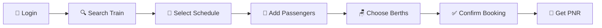

<div align="center">

# 🚂 Railway Ticket Reservation System

### *Your Journey Begins Here* ✨

[](https://www.djangoproject.com/)
[](https://www.python.org/)
[](LICENSE)
[]()

*A comprehensive, feature-rich Django web application for seamless railway ticket booking and management*

[Features](#-features) • [Installation](#-installation) • [Usage](#-usage) • [Documentation](#-database-models) • [Contributing](#-contributing)

---

</div>

## 🌟 Overview

Welcome to the **Railway Ticket Reservation System** - a modern, full-featured web application that brings the convenience of online railway booking to your fingertips. Built with Django and designed with user experience in mind, this system handles everything from train searches to berth allocation with Indian Railways standards.

<div align="center">

### 🎯 *Book • Track • Manage* - All in One Place

</div>

---

## ✨ Features

<table>
<tr>
<td width="50%">

### 👤 User Management
- 🔐 **Secure Authentication**
  - Login/Logout with session management
  - Password encryption & validation
- 📝 **User Registration**
  - Quick signup process
  - Email validation
- 🛡️ **Access Control**
  - Login-protected booking system
  - Role-based permissions

</td>
<td width="50%">

### 🎫 Ticket Booking
- 🔍 **Smart Search**
  - Search by route & date
  - Real-time availability
- 👥 **Multi-Passenger**
  - Book up to 6 passengers
  - Group booking support
- 🪑 **Berth Preference**
  - Lower/Middle/Upper berths
  - Side berth options

</td>
</tr>
<tr>
<td width="50%">

### 🎯 Smart Allocation
- 🤖 **Auto-Assignment**
  - Intelligent seat allocation
  - Berth-type based numbering
- 📊 **Real-time Tracking**
  - Live seat availability
  - Coach-wise monitoring
- ✅ **Validation**
  - Duplicate prevention
  - Same-person check

</td>
<td width="50%">

### 📱 PNR Management
- 🔢 **Unique PNR**
  - 10-digit auto-generation
  - Secure & traceable
- 🔎 **Status Check**
  - Real-time lookup
  - Complete journey info
- ➕ **Add Passengers**
  - Same PNR additions
  - Group management

</td>
</tr>
</table>

---

## 🚄 Train & Route Features

<div align="center">

| Feature | Description | Status |
|---------|-------------|--------|
| 🚂 **Train Types** | Express, Shatabdi, Rajdhani, Duronto, Garib Rath | ✅ Active |
| 🗺️ **Stations** | 8 Major Indian Railway Stations | ✅ Active |
| ⏰ **Schedules** | Multi-station routes with timing | ✅ Active |
| 💰 **Dynamic Fares** | Base + Distance + Class charges | ✅ Active |

</div>

---

## 🪑 Coach & Berth System

<div align="center">

### 📋 Berth Distribution by Coach Type

</div>

```
┌─────────────────────────────────────────────────────────────┐
│                    SLEEPER / AC 3-TIER (72 Seats)           │
├─────────────────────────────────────────────────────────────┤
│  Lower: 18   │  Middle: 18  │  Upper: 18  │  Side: 18      │
│  (1,4,7...)  │  (2,5,8...)  │  (3,6,9...) │  (64-72)       │
└─────────────────────────────────────────────────────────────┘

┌─────────────────────────────────────────────────────────────┐
│                      AC 2-TIER (48 Seats)                   │
├─────────────────────────────────────────────────────────────┤
│  Lower: 16   │  Upper: 16   │  Side Lower: 8  │  Side Upper: 8  │
│  (1,3,5...)  │  (2,4,6...)  │  (43,45,47)     │  (44,46,48)     │
└─────────────────────────────────────────────────────────────┘

┌─────────────────────────────────────────────────────────────┐
│                   AC 1-TIER (24 Seats - Cabins)             │
├─────────────────────────────────────────────────────────────┤
│         Lower: 12 (1,3,5...)  │  Upper: 12 (2,4,6...)       │
└─────────────────────────────────────────────────────────────┘
```

---

## 🛠️ Technology Stack

<div align="center">

### *Built with Modern Technologies*

<table>
<tr>
<td align="center" width="33%">
<br/>
<b>Django 5.1.3</b><br/>
<sub>Backend Framework</sub>
</td>
<td align="center" width="33%">
<br/>
<b>Python 3.8+</b><br/>
<sub>Programming Language</sub>
</td>
<td align="center" width="33%">
<br/>
<b>Tailwind CSS</b><br/>
<sub>Styling Framework</sub>
</td>
</tr>
<tr>
<td align="center">
<b>SQLite/PostgreSQL</b><br/>
<sub>Database</sub>
</td>
<td align="center">
<b>Django ORM</b><br/>
<sub>Data Management</sub>
</td>
<td align="center">
<b>Django Auth</b><br/>
<sub>Security</sub>
</td>
</tr>
</table>

</div>

---

## 📋 Prerequisites

<div align="center">

```bash
✓ Python 3.8 or higher
✓ pip (Python package manager)
✓ Virtual environment (recommended)
✓ Git (for cloning)
```

</div>

---

## 🚀 Installation

<div align="center">

### *Get Started in 5 Minutes!* ⚡

</div>

### 1️⃣ Clone the Repository

```bash
git clone <repository-url>
cd TicketReservationSystemWeb/DemoProject
```

### 2️⃣ Set Up Virtual Environment

```bash
# Create virtual environment
python -m venv venv

# Activate (Linux/Mac)
source venv/bin/activate

# Activate (Windows)
venv\Scripts\activate
```

### 3️⃣ Install Dependencies

```bash
pip install django
```

### 4️⃣ Database Setup

```bash
# Create database tables
python manage.py makemigrations
python manage.py migrate

# Populate with sample data
python manage.py seed_data
```

<details>
<summary><b>📦 What gets seeded?</b></summary>

- ✅ 8 Major Indian Railway Stations
- ✅ 5 Trains (Express, Shatabdi, Rajdhani, etc.)
- ✅ 40+ Coaches with berth distribution
- ✅ Train routes with timings
- ✅ Fare structures for all routes

</details>

### 5️⃣ Create Admin User

```bash
python manage.py createsuperuser
```

### 6️⃣ Launch the Server

```bash
python manage.py runserver
```

### 7️⃣ Access the Application

<div align="center">

| Service | URL | Description |
|---------|-----|-------------|
| 🌐 **Main Site** | http://127.0.0.1:8000/ | User Interface |
| 🔧 **Admin Panel** | http://127.0.0.1:8000/admin/ | Management Console |

</div>

---

## 📱 Usage Guide

<div align="center">

### 🎫 *How to Book Your First Ticket*

</div>



### Step-by-Step Process

<table>
<tr>
<td width="10%">

**1**

</td>
<td>

**Login or Register**
- Navigate to the home page
- Click "Book Your Ticket Now"
- Login with credentials or create new account

</td>
</tr>
<tr>
<td>

**2**

</td>
<td>

**Search for Trains**
- Select departure & arrival stations
- Choose journey date
- Pick your preferred train

</td>
</tr>
<tr>
<td>

**3**

</td>
<td>

**View Schedules**
- Browse available schedules
- Check seat availability
- Click "Book" on preferred schedule

</td>
</tr>
<tr>
<td>

**4**

</td>
<td>

**Enter Passenger Details**
- Name, Age, Gender (up to 6 passengers)
- Select seat class
- Choose coach
- Pick berth preference (optional)

</td>
</tr>
<tr>
<td>

**5**

</td>
<td>

**Confirm & Pay**
- Review booking details
- Submit the form
- Receive unique PNR number

</td>
</tr>
</table>

### 🔍 Checking PNR Status

```bash
1. Click "Check PNR Status" (login required)
2. Enter your 10-digit PNR
3. View complete journey & passenger details
4. Check seat/berth assignments
```

### ➕ Adding More Passengers

```bash
1. Open your ticket details page
2. Click "Add More Passengers"
3. Fill new passenger information
4. Submit - they'll be added to same PNR!
```

---

## 📊 Database Models

<div align="center">

### *Database Architecture*

</div>

```
┌─────────────┐       ┌──────────────┐       ┌─────────────┐
│   Station   │──────▶│  TrainRoute  │◀──────│    Train    │
└─────────────┘       └──────────────┘       └─────────────┘
                              │                      │
                              │                      │
                              ▼                      ▼
┌─────────────┐       ┌──────────────┐       ┌─────────────┐
│    Fare     │       │TrainSchedule │       │    Coach    │
└─────────────┘       └──────────────┘       └─────────────┘
                              │                      │
                              ▼                      │
                      ┌──────────────┐               │
                      │    Ticket    │               │
                      └──────────────┘               │
                              │                      │
                              ▼                      │
                      ┌──────────────┐               │
                      │  Passenger   │◀──────────────┘
                      └──────────────┘
```

### Core Models

| Model | Purpose | Key Fields |
|-------|---------|------------|
| 🏢 **Station** | Railway stations | Code, Name, City, State |
| 🚂 **Train** | Train information | Number, Name, Type, Total Seats |
| 🗺️ **TrainRoute** | Station routes | Train, Station, Timing, Sequence |
| 📅 **TrainSchedule** | Daily schedules | Train, Journey Date, Status |
| 🚃 **Coach** | Coach details | Type, Capacity, Berth tracking |
| 💰 **Fare** | Pricing | Base, Distance, Class charges |
| 🎫 **Ticket** | Bookings | PNR, Schedule, Source, Destination |
| 👤 **Passenger** | Traveler info | Name, Age, Seat, Berth, Status |

---

## 🔧 Project Structure

```
DemoProject/
│
├── 📁 mainApp/
│   ├── 📁 management/
│   │   └── 📁 commands/
│   │       └── 📄 seed_data.py          # Database seeding
│   │
│   ├── 📁 migrations/                   # Database migrations
│   │
│   ├── 📁 templates/
│   │   └── 📁 mainApp/
│   │       ├── 🏠 home.html            # Landing page
│   │       ├── 🔐 login.html           # Login page
│   │       ├── 📝 signup.html          # Registration
│   │       ├── 🔍 select_destinations.html
│   │       ├── 📅 schedule_list.html
│   │       ├── 🎫 book_ticket.html
│   │       ├── 📄 ticket_detail.html
│   │       └── 🔎 pnr_status.html
│   │
│   ├── 📄 models.py                     # Data models
│   ├── 📄 views.py                      # Business logic
│   ├── 📄 forms.py                      # Form definitions
│   ├── 📄 urls.py                       # URL routing
│   └── 📄 admin.py                      # Admin interface
│
├── 📁 DemoProject/
│   ├── ⚙️ settings.py                   # Configuration
│   ├── 🌐 urls.py                       # Main URL config
│   └── 🚀 wsgi.py                       # WSGI config
│
├── 💾 db.sqlite3                        # Database
└── 🎯 manage.py                         # Django CLI
```

---

## 🔐 Security Features

<div align="center">

| Feature | Implementation | Status |
|---------|----------------|--------|
| 🛡️ **CSRF Protection** | All forms protected | ✅ |
| 🔒 **Authentication** | Session-based auth | ✅ |
| 🔑 **Password Security** | Django bcrypt hashing | ✅ |
| 🚫 **SQL Injection** | ORM parameterization | ✅ |
| 👤 **Access Control** | Login decorators | ✅ |

</div>

---

## 🎯 Future Enhancements

<div align="center">

### *Roadmap for Version 2.0* 🚀

</div>

<table>
<tr>
<td width="50%">

#### 💳 Payment & Notifications
- [ ] Payment gateway integration (Razorpay/Stripe)
- [ ] Email confirmation system
- [ ] SMS notifications
- [ ] QR code tickets

</td>
<td width="50%">

#### 📊 Advanced Features
- [ ] User booking history
- [ ] Ticket cancellation with refund
- [ ] Waiting list (RAC) management
- [ ] Train live tracking

</td>
</tr>
<tr>
<td>

#### 🎨 UI/UX Improvements
- [ ] Seat availability calendar
- [ ] Interactive seat selection
- [ ] Multi-language support
- [ ] Dark mode theme

</td>
<td>

#### 📱 Technical Upgrades
- [ ] PDF ticket generation
- [ ] RESTful API
- [ ] Mobile app (React Native)
- [ ] Real-time chat support

</td>
</tr>
</table>

---

## 🐛 Known Issues

<div align="center">

| Issue | Impact | Priority |
|-------|--------|----------|
| ⚠️ Berth preference not guaranteed when full | Low | Medium |
| ⚠️ Session persistence | Low | Low |
| ⚠️ Manual seat selection not available | Medium | High |

</div>

---

## 👥 Contributing

<div align="center">

### *We Welcome Contributions!* 🤝

</div>

```bash
# 1. Fork the repository
# 2. Create your feature branch
git checkout -b feature/AmazingFeature

# 3. Commit your changes
git commit -m '✨ Add some AmazingFeature'

# 4. Push to the branch
git push origin feature/AmazingFeature

# 5. Open a Pull Request
```

### Contribution Guidelines

- 📝 Write clear commit messages
- 🧪 Include tests for new features
- 📚 Update documentation
- 🎨 Follow PEP 8 style guide
- ✅ Ensure all tests pass

---

## 📄 License

<div align="center">

This project is licensed under the **MIT License**

*Free to use, modify, and distribute*

</div>

---

## 📧 Contact & Support

<div align="center">

### *Need Help?* 💬

📧 **Email**: support@railwaytickets.com  
🐛 **Issues**: [GitHub Issues](https://github.com/your-repo/issues)  
💡 **Discussions**: [GitHub Discussions](https://github.com/your-repo/discussions)

</div>

---

## 🙏 Acknowledgments

<div align="center">

Special thanks to:

🎓 **Django Documentation** - Comprehensive framework guide  
🚂 **Indian Railways** - Inspiration and standards  
🎨 **Tailwind CSS** - Beautiful styling  
👥 **Contributors** - Community support  
🧪 **Testers** - Quality assurance  

</div>

---

<div align="center">

## ⭐ Star this Repository

*If you find this project helpful, please consider giving it a star!*

[](https://github.com/your-username/railway-reservation)
[](https://github.com/your-username/railway-reservation)

---

### 🚂 *Happy Journey with Railway Reservation System!* ✨

**Version**: 1.0.0 | **Last Updated**: November 2025

Made with ❤️ by the Development Team

---

</div>
