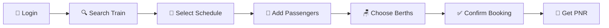

<div align="center">

# 🚂 Railway Ticket Reservation System

### *Your Journey Begins Here* ✨

[](https://www.djangoproject.com/)
[](https://www.python.org/)
[](https://tailwindcss.com/)
[](https://www.sqlite.org/)
[](LICENSE)

*A comprehensive, feature-rich Django web application for seamless railway ticket booking and management*

[Features](#-features) • [Installation](#-installation) • [Usage](#-usage-guide) • [Documentation](#-database-models) • [Contributing](#-contributing)

---


</div>

## 🌟 Overview

Welcome to **GetSetRide** - A modern, full-featured railway ticket reservation system built with Django. Experience the convenience of online railway booking with intelligent seat allocation, real-time availability tracking, and comprehensive journey management.

<div align="center">

### 🎯 *Book • Track • Manage* - All in One Place

</div>

---

## ✨ Features

<table>
<tr>
<td width="50%">

### 👤 User Management
- 🔐 **Secure Authentication**
  - Login/Logout with session management
  - Password encryption & validation
  - CSRF protection
- 📝 **User Registration**
  - Quick signup process
  - Form validation
- 🛡️ **Access Control**
  - Login-protected booking system
  - Decorator-based route protection

</td>
<td width="50%">

### 🎫 Ticket Booking
- 🔍 **Smart Search**
  - Search by route & date
  - Real-time availability
  - Dynamic schedule display
- 👥 **Multi-Passenger Booking**
  - Book up to 6 passengers
  - Group booking support
  - Individual passenger details
- 🪑 **Berth Preference**
  - Lower/Middle/Upper berths
  - Side berth options
  - Auto-assignment algorithm

</td>
</tr>
<tr>
<td width="50%">

### 🎯 Smart Seat Allocation
- 🤖 **Intelligent Assignment**
  - Automated seat allocation
  - Berth-type based numbering
  - Coach-wise distribution
- 📊 **Real-time Tracking**
  - Live seat availability
  - Coach-wise monitoring
  - Berth availability per coach
- ✅ **Validation**
  - Duplicate booking prevention
  - Same-person check
  - Capacity constraints

</td>
<td width="50%">

### 📱 PNR Management
- 🔢 **Unique PNR Generation**
  - 10-digit alphanumeric PNR
  - Auto-generation on booking
  - Collision detection
- 🔎 **Status Check**
  - Real-time PNR lookup
  - Complete journey information
  - Passenger details display
- ➕ **Add Passengers**
  - Add to existing PNR
  - Same journey extension
  - Dynamic fare calculation

</td>
</tr>
<tr>
<td width="50%">

### 🚄 Train Management
- 🗺️ **Route Planning**
  - Multi-station routes
  - Sequential station ordering
  - Distance tracking
- ⏰ **Schedule Management**
  - Daily train schedules
  - Status tracking
  - Delay monitoring
- 🚂 **Train Types**
  - Express, Superfast
  - Rajdhani, Shatabdi
  - Duronto, Passenger

</td>
<td width="50%">

### 💰 Fare System
- 📊 **Dynamic Pricing**
  - Base fare calculation
  - Distance-based pricing
  - Class-based multipliers
- 💳 **Class Tiers**
  - General (1.0x)
  - Sleeper (1.5x)
  - AC 3-Tier (2.0x)
  - AC 2-Tier (3.0x)
  - AC 1-Tier (5.0x)
  - First Class (6.0x)
- 📝 **Transparent Billing**
  - Itemized fare breakdown
  - No hidden charges

</td>
</tr>
</table>

---

## 🚄 Train & Route Features

<div align="center">

| Feature | Description | Status |
|---------|-------------|--------|
| 🚂 **Train Types** | Express, Shatabdi, Rajdhani, Duronto, Superfast | ✅ Active |
| 🗺️ **Stations** | 8 Major Indian Railway Stations | ✅ Active |
| ⏰ **Schedules** | Multi-station routes with timing | ✅ Active |
| 💰 **Dynamic Fares** | Base + Distance + Class charges | ✅ Active |
| 🎫 **PNR System** | 10-digit unique identifiers | ✅ Active |

</div>

---

## 🪑 Coach & Berth System

<div align="center">

### 📋 Berth Distribution by Coach Type

| Coach Type | Total Seats | Lower | Middle | Upper | Side Lower | Side Upper |
|------------|-------------|-------|--------|-------|------------|------------|
| **Sleeper** | 72 | 24 | 24 | 24 | 0 | 0 |
| **AC 3-Tier** | 64 | 18 | 18 | 18 | 5 | 5 |
| **AC 2-Tier** | 48 | 24 | 0 | 24 | 0 | 0 |
| **AC 1-Tier** | 24 | 12 | 0 | 12 | 0 | 0 |
| **General** | 100 | 0 | 0 | 0 | 0 | 0 |
| **First Class** | 32 | 16 | 0 | 16 | 0 | 0 |

</div>

---

## 🛠️ Technology Stack

<div align="center">

### *Built with Modern Technologies*

<table>
<tr>
<td align="center" width="25%">
<br/>
<b>Django 5.1.3</b><br/>
<sub>Backend Framework</sub>
</td>
<td align="center" width="25%">
<br/>
<b>Python 3.8+</b><br/>
<sub>Programming Language</sub>
</td>
<td align="center" width="25%">
<br/>
<b>Tailwind CSS</b><br/>
<sub>Styling Framework</sub>
</td>
<td align="center" width="25%">
<br/>
<b>SQLite</b><br/>
<sub>Database</sub>
</td>
</tr>
<tr>
<td align="center">
<b>Django ORM</b><br/>
<sub>Data Management</sub>
</td>
<td align="center">
<b>Django Auth</b><br/>
<sub>Security</sub>
</td>
<td align="center">
<b>HTML5/CSS3</b><br/>
<sub>Frontend</sub>
</td>
<td align="center">
<b>JavaScript</b><br/>
<sub>Interactivity</sub>
</td>
</tr>
</table>

</div>

---

## 📋 Prerequisites

<div align="center">

```bash
✅ Python 3.8 or higher
✅ pip (Python package manager)
✅ Virtual environment (recommended)
✅ Git (for cloning)
```

</div>

---

## 🚀 Installation

<div align="center">

### *Get Started in 5 Minutes!* ⚡

</div>

### 1️⃣ Clone the Repository

```bash
git clone https://github.com/yourusername/railway-reservation-system.git
cd railway-reservation-system/DemoProject
```

### 2️⃣ Set Up Virtual Environment

```bash
# Create virtual environment
python -m venv venv

# Activate (Linux/Mac)
source venv/bin/activate

# Activate (Windows)
venv\Scripts\activate
```

### 3️⃣ Install Dependencies

```bash
pip install django
```

### 4️⃣ Database Setup

```bash
# Create database tables
python manage.py makemigrations
python manage.py migrate

# Populate with sample data
python manage.py seed_data
```

<details>
<summary><b>📦 What gets seeded?</b></summary>

- ✅ 8 Major Indian Railway Stations
- ✅ 5 Trains (Express, Shatabdi, Rajdhani, etc.)
- ✅ 40+ Coaches with berth distribution
- ✅ Train routes with timings
- ✅ Fare structures for all routes
- ✅ Sample schedules for next 7 days

</details>

### 5️⃣ Create Admin User

```bash
python manage.py createsuperuser
```

### 6️⃣ Launch the Server

```bash
python manage.py runserver
```

### 7️⃣ Access the Application

<div align="center">

| Service | URL | Description |
|---------|-----|-------------|
| 🌐 **Main Site** | http://127.0.0.1:8000/ | User Interface |
| 🔧 **Admin Panel** | http://127.0.0.1:8000/admin/ | Management Console |

</div>

---

## 📱 Usage Guide

<div align="center">

### 🎫 *How to Book Your First Ticket*

</div>



### Step-by-Step Process

<table>
<tr>
<td width="10%">

**1**

</td>
<td>

**Login or Register**
- Navigate to the home page
- Click "Book Your Ticket Now"
- Login with credentials or create new account

</td>
</tr>
<tr>
<td>

**2**

</td>
<td>

**Search for Trains**
- Select departure & arrival stations
- Choose journey date
- View available trains

</td>
</tr>
<tr>
<td>

**3**

</td>
<td>

**View Schedules**
- Browse available schedules
- Check seat availability
- View fare information
- Click "Book" on preferred schedule

</td>
</tr>
<tr>
<td>

**4**

</td>
<td>

**Enter Passenger Details**
- Add passenger information (up to 6)
  - Name, Age, Gender
- Select seat class
- Choose coach
- Pick berth preference (optional)

</td>
</tr>
<tr>
<td>

**5**

</td>
<td>

**Confirm & Book**
- Review booking details
- Check total fare
- Submit the booking
- Receive unique PNR number

</td>
</tr>
</table>

### 🔍 Checking PNR Status

```bash
1. Click "Check PNR Status" (login required)
2. Enter your 10-digit PNR
3. View complete journey & passenger details
4. Check seat/berth assignments
```

### ➕ Adding More Passengers

```bash
1. Open your ticket details page
2. Click "Add More Passengers"
3. Fill new passenger information
4. Submit - they'll be added to same PNR!
```

---

## 📊 Database Models

<div align="center">

### *Database Architecture*

</div>

### Core Models

| Model | Purpose | Key Fields |
|-------|---------|------------|
| 🏢 **Station** | Railway stations | Code, Name, City, State |
| 🚂 **Train** | Train information | Number, Name, Type, Total Seats |
| 🗺️ **TrainRoute** | Station routes | Train, Station, Timing, Sequence |
| 📅 **TrainSchedule** | Daily schedules | Train, Journey Date, Status |
| 🚃 **Coach** | Coach details | Type, Capacity, Berth tracking |
| 💰 **Fare** | Pricing | Base, Distance, Class charges |
| 🎫 **Ticket** | Bookings | PNR, Schedule, Source, Destination |
| 👤 **Passenger** | Traveler info | Name, Age, Seat, Berth, Status |

### Database Relationships

```
Station ──┐
          ├──> TrainRoute ──> Train ──┐
Station ──┘                           ├──> TrainSchedule ──> Ticket ──> Passenger
                                      │
                             Coach ───┘
```

---

## 🔧 Project Structure

```
DemoProject/
│
├── 📁 mainApp/
│   ├── 📁 management/
│   │   └── 📁 commands/
│   │       └── 📄 seed_data.py          # Database seeding
│   │
│   ├── 📁 migrations/                   # Database migrations
│   │
│   ├── 📁 templates/
│   │   └── 📁 mainApp/
│   │       ├── 🏠 home.html            # Landing page
│   │       ├── 🔐 login.html           # Login page
│   │       ├── 📝 signup_page.html     # Registration
│   │       ├── 🔍 select_destinations.html
│   │       ├── 📅 schedule_list.html
│   │       ├── 🎫 book_ticket.html
│   │       ├── 📄 ticket_detail.html
│   │       ├── 🔎 pnr_status.html
│   │       ├── ➕ add_passengers.html
│   │       ├── ❌ cancel_ticket.html
│   │       ├── ℹ️ features.html
│   │       └── 📧 contact.html
│   │
│   ├── 📁 static/
│   │   └── 📁 mainApp/
│   │       └── 🖼️ train.png
│   │
│   ├── 📄 models.py                     # Data models
│   ├── 📄 views.py                      # Business logic
│   ├── 📄 forms.py                      # Form definitions
│   ├── 📄 urls.py                       # URL routing
│   └── 📄 admin.py                      # Admin interface
│
├── 📁 DemoProject/
│   ├── ⚙️ settings.py                   # Configuration
│   ├── 🌐 urls.py                       # Main URL config
│   └── 🚀 wsgi.py                       # WSGI config
│
├── 💾 db.sqlite3                        # Database
├── 📄 manage.py                         # Django CLI
└── 📖 README.md                         # Documentation
```

---

## 🔐 Security Features

<div align="center">

| Feature | Implementation | Status |
|---------|----------------|--------|
| 🛡️ **CSRF Protection** | All forms protected | ✅ |
| 🔒 **Authentication** | Session-based auth | ✅ |
| 🔑 **Password Security** | Django bcrypt hashing | ✅ |
| 🚫 **SQL Injection** | ORM parameterization | ✅ |
| 👤 **Access Control** | Login decorators | ✅ |
| ✅ **Form Validation** | Server-side validation | ✅ |

</div>

---

## 🎯 Future Enhancements

<div align="center">

### *Roadmap for Version 2.0* 🚀

</div>

<table>
<tr>
<td width="50%">

#### 💳 Payment & Notifications
- [ ] Payment gateway integration (Razorpay/Stripe)
- [ ] Email confirmation system
- [ ] SMS notifications
- [ ] QR code tickets
- [ ] E-ticket PDF generation

</td>
<td width="50%">

#### 📊 Advanced Features
- [ ] User booking history
- [ ] Ticket cancellation with refund
- [ ] Waiting list (RAC) management
- [ ] Train live tracking
- [ ] Seat selection visualization

</td>
</tr>
<tr>
<td>

#### 🎨 UI/UX Improvements
- [ ] Seat availability calendar
- [ ] Interactive seat selection
- [ ] Multi-language support
- [ ] Dark mode theme
- [ ] Responsive mobile design

</td>
<td>

#### 📱 Technical Upgrades
- [ ] RESTful API
- [ ] Mobile app (React Native)
- [ ] Real-time chat support
- [ ] Analytics dashboard
- [ ] Performance optimization

</td>
</tr>
</table>

---

## 🐛 Known Issues

<div align="center">

| Issue | Impact | Priority | Status |
|-------|--------|----------|--------|
| ⚠️ Berth preference not guaranteed when coach is full | Low | Medium | 📝 Planned |
| ⚠️ Session persistence across server restarts | Low | Low | 📝 Planned |
| ⚠️ Manual seat selection not available | Medium | High | 🔄 In Progress |
| ⚠️ Cancel ticket refund calculation | Low | Medium | 📝 Planned |

</div>

---

## 👥 Contributing

<div align="center">

### *We Welcome Contributions!* 🤝

</div>

```bash
# 1. Fork the repository
# 2. Create your feature branch
git checkout -b feature/AmazingFeature

# 3. Commit your changes
git commit -m '✨ Add some AmazingFeature'

# 4. Push to the branch
git push origin feature/AmazingFeature

# 5. Open a Pull Request
```

### Contribution Guidelines

- 📝 Write clear, descriptive commit messages
- 🧪 Include tests for new features
- 📚 Update documentation as needed
- 🎨 Follow PEP 8 style guide for Python
- ✅ Ensure all tests pass before submitting
- 💬 Be respectful and constructive in discussions

---

## 📄 License

<div align="center">

This project is licensed under the **MIT License**

*Free to use, modify, and distribute with attribution*

See [LICENSE](LICENSE) file for details

</div>

---

## 📧 Contact & Support

<div align="center">

### *Need Help?* 💬

📧 **Email**: support@getsetride.com  
🐛 **Issues**: [GitHub Issues](https://github.com/yourusername/railway-reservation-system/issues)  
💡 **Discussions**: [GitHub Discussions](https://github.com/yourusername/railway-reservation-system/discussions)  
📖 **Documentation**: [Wiki](https://github.com/yourusername/railway-reservation-system/wiki)

</div>

---

## 🙏 Acknowledgments

<div align="center">

Special thanks to:

🎓 **Django Documentation** - Comprehensive framework guide  
🚂 **Indian Railways** - Inspiration and operational standards  
🎨 **Tailwind CSS** - Beautiful, responsive styling  
👥 **Open Source Community** - Continuous support and inspiration  
🧪 **Beta Testers** - Valuable feedback and bug reports

</div>

---

<div align="center">

## ⭐ Star this Repository

*If you find this project helpful, please consider giving it a star!*

[](https://github.com/yourusername/railway-reservation-system)
[](https://github.com/yourusername/railway-reservation-system)
[](https://github.com/yourusername/railway-reservation-system)

---

### 🚂 *Happy Journey with GetSetRide!* ✨

**Version**: 1.0.0 | **Last Updated**: January 2025

Made with ❤️ by the GetSetRide Team

---

[⬆ Back to Top](#-railway-ticket-reservation-system)

</div>
